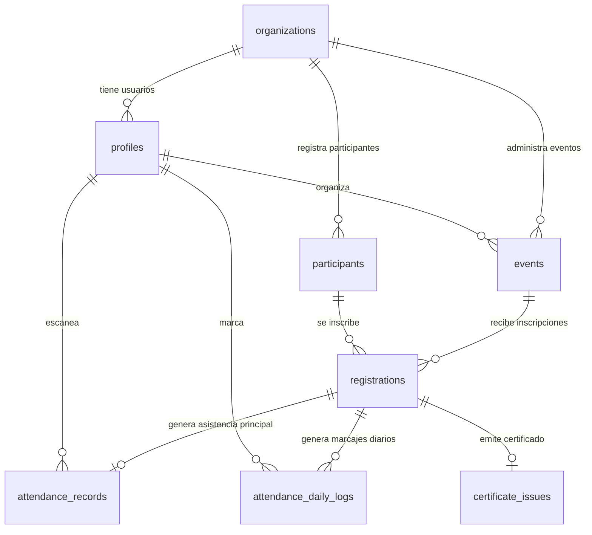

# Diagrama De Base De Datos



## Flujo Principal

1. `organizations`: representa la institucion.
2. `profiles`: usuarios internos del sistema.
3. `events`: eventos creados por admin u organizador.
4. `participants`: personas que llenan el formulario.
5. `registrations`: inscripcion del participante en un evento.
6. `attendance_records`: asistencia inicial o principal.
7. `attendance_daily_logs`: marcajes adicionales por dia/hora.
8. `certificate_issues`: certificados emitidos.

## Como Leerlo En Supabase

Ejecuta:

```sql
select * from public.vista_eventos;
select * from public.vista_participantes;
select * from public.vista_inscripciones;
select * from public.vista_asistencias;
```

Estas vistas no reemplazan las tablas reales. Solo son una capa de lectura en español.
